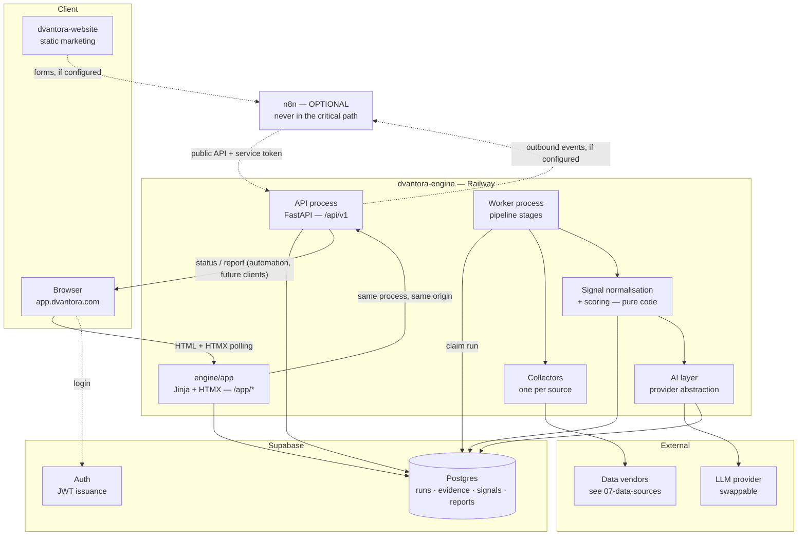
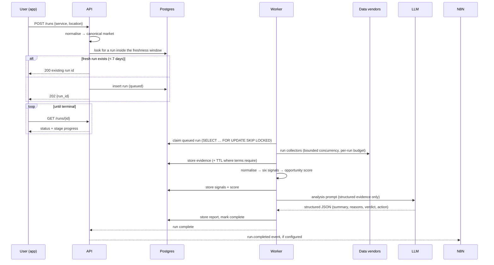

# 01 — Technical Architecture (MVP)

**Status:** APPROVED — decisions 1–7
**Last updated:** 2026-08-27
**Prerequisite reading:** `00-overview.md`
**Related:** `07-data-sources.md`

Approved decisions are recorded in `docs/adr/`. Section 10 lists their status.
All seven are now decided; a change to any of them requires a new ADR and an
update to this document.

---

## 1. Constraints this design optimises for

1. **One developer, AI-assisted.** Favour few moving parts, boring technology,
   and code an AI agent can read end to end. Every component added is a
   component that must be debugged at 11pm by one person.
2. **Deterministic core, probabilistic edge.** Collection, normalisation and
   scoring are plain, testable code. Only the written analysis is generative.
3. **Low fixed cost.** Idle cost near zero; variable cost bounded per run.
4. **Evidence is the asset.** Raw collected data is stored permanently and
   independently of scoring — subject to the storage restrictions in
   `07-data-sources.md` §5.1 — so scoring can be re-tuned without re-paying for
   collection.
5. **Reversible.** Every third-party dependency — data vendor, LLM provider,
   automation platform — sits behind an internal interface, so swapping one is
   a file, not a refactor.
6. **No single vendor is load-bearing for the product's existence.** In
   particular the engine runs to completion with no automation platform
   attached (§7).

---

## 2. Repositories

**APPROVED:** two repositories, not a monorepo.

```
dvantora-website/          (exists — github.com/Jhuncarlchavez223/dvantora-website)
├─ index.html  404.html  robots.txt  sitemap.xml
├─ about/  contact/  privacy/  terms/
└─ assets/{css,js,img}/
    Static marketing site. Unchanged. No build step, no dependencies.

dvantora-engine/           (to be created)
├─ docs/                   The approved specification — this folder
│  └─ adr/                 Architecture decision records
├─ engine/
│  ├─ api/                 HTTP layer (FastAPI)
│  ├─ pipeline/            Run orchestration and stages
│  ├─ collectors/          One module per data source (see 07-data-sources.md)
│  ├─ signals/             Normalisation + scoring (pure, unit-tested)
│  ├─ ai/                  Provider abstraction, prompt contracts, schemas
│  ├─ db/                  Models and migrations
│  └─ tests/
│  └─ app/                 Authenticated product UI — server-rendered (ADR-0007)
│     ├─ routes.py         /app/* HTML endpoints
│     ├─ templates/        Jinja2, reusing the marketing site's design tokens
│     └─ static/           main.css and assets
├─ automation/             Exported n8n workflow JSON, when n8n is adopted
└─ README.md  CLAUDE.md
```

### Consequences of the two-repo split

- **The website repo needs no restructure.** The `site/` move proposed in the
  previous draft is cancelled. The marketing site stays exactly as it is.
- **`docs/` belongs in `dvantora-engine`.** It currently sits in the website
  repo as a working location only.
  ⚠️ **`docs/` must not be committed to the website repo** — that repo deploys
  from its root with `robots.txt` allowing all crawlers, so the specification,
  including vendor pricing and cost-per-run economics, would be publicly
  readable at `dvantora.com/docs/…`. Move `docs/` to the engine repo as its
  first commit. See `07-data-sources.md` §11.
- **The app ships from the engine process**, not merely the engine repo
  (ADR-0007). `engine/app/` is server-rendered by the same FastAPI application
  that serves `/api/v1`, so the UI and the contract cannot drift apart and there
  is no second build, deploy target or origin.
- **Cross-repo coupling is limited to one thing:** the public REST contract in
  `05-api-contract.md`. The website never calls the API.

---

## 3. System overview



Dotted edges are optional. Remove every dotted edge and the product still
works end to end.

## 4. Components

| Component | Technology | Responsibility |
|---|---|---|
| Marketing site | Static HTML/CSS/JS, existing repo | Marketing only |
| `engine/app/` | FastAPI + Jinja2 + HTMX, server-rendered (ADR-0007) | Authenticated UI: new analysis, run progress, report, market list |
| API process | Python 3.12 + FastAPI | Auth validation, market resolution, enqueue, read endpoints, outbound events. Also serves `engine/app/` |
| Worker process | Same codebase, separate Railway service | Executes pipeline stages, writes evidence, triggers scoring and AI |
| Database | Supabase Postgres | Single source of truth. Also the job queue. |
| Auth | Supabase Auth | Signup, login, password reset, JWT issuance |
| Collectors | Python modules | One per source; uniform interface; replay mode for tests |
| Scoring | Python, pure functions | Deterministic; no network, no model calls |
| AI layer | Provider abstraction over an LLM API | Writes the analysis, strictly grounded in stored evidence |
| n8n | Optional, self-hosted or Cloud | Integrations and scheduling only — never required |

**Why Python/FastAPI:** the work is collection, normalisation and scoring;
Python has the strongest library surface for it, and one language across API,
worker, scoring and AI keeps a solo codebase small.

---

## 5. The research run — lifecycle

A run is an explicit state machine persisted in Postgres. No part of a run's
state lives only in memory, and none of it lives in n8n.

```
queued → collecting → scoring → analyzing → complete
                 ↘ partial (some collectors failed, score still produced)
                 ↘ failed  (not enough evidence to score)
```



### Design rules

- **Postgres is the queue.** `SELECT … FOR UPDATE SKIP LOCKED` on the runs
  table. No Redis, no Celery, no external scheduler for the MVP.
- **Collectors are independent and fail soft.** A failure is recorded as
  evidence-of-absence; the run continues, that signal's confidence drops, and
  the report states the signal was unavailable.
- **Evidence is dated and attributed.** Every row carries its vendor and fetch
  timestamp. Rows whose source terms require deletion carry a TTL and are
  purged by a scheduled job inside the engine — not by n8n.
- **Per-run budget cap.** Every run carries a ceiling in currency and in
  wall-clock seconds (`07-data-sources.md` §8). Exceeding it ends collection and
  scores what exists.
- **Freshness window: 7 days (APPROVED).** Configurable globally and
  per-source; business listings and search volume change slowly, ad activity
  does not. Users can force a fresh run. This is a configuration value, never a
  literal in pipeline code.
- **Idempotency.** Retrying a stage never duplicates evidence rows.

---

## 6. AI analysis layer

The AI layer is deliberately narrow. It does **not** decide the score.

| Step | Who does it |
|---|---|
| Collect raw data | Collectors (code) |
| Normalise to 0–100 sub-scores | Signals module (code, unit-tested) |
| Compute opportunity score | Scoring module (code, deterministic) |
| Decide verdict thresholds | Scoring module (code) |
| Write the summary and numbered reasons | LLM |
| Explain apparent conflicts in evidence | LLM |
| Suggest an entry segment | LLM |

### 6.1 Provider abstraction (APPROVED — decision 5)

All model access goes through one internal interface:

```
ai/
├─ provider.py        Protocol: complete_structured(prompt, schema) -> dict
├─ providers/
│  ├─ anthropic.py
│  └─ <others as needed>
├─ prompts/           Versioned prompt files
└─ schemas/           JSON Schemas for every structured output
```

Rules:

- **No provider SDK is imported anywhere outside `ai/providers/`.** This is the
  test that keeps the abstraction real; it should be enforced by a lint rule.
- Provider and model are configuration, not code.
- Every report stores the `provider`, `model` and `prompt_version` used, so any
  past report can be explained or reproduced.
- The interface is defined in terms of **structured output against a JSON
  Schema**, not free text, because that is the capability being depended on.
- An eval set of fixed evidence payloads with expected report properties runs
  against any candidate provider before a switch (`06-ai-analysis.md`).

### 6.2 Grounding rules

- The model receives **only** structured signals and their supporting evidence —
  never raw HTML, never unbounded text.
- Output is validated against a strict schema (summary, 3–5 numbered reasons,
  verdict, recommended action, caveats). Violations are retried once, then the
  run completes with a template-generated fallback summary.
- **Every generated numeric claim must appear in the input evidence.** A
  post-generation check rejects numbers that do not.
- Signals that could not be collected must be named as absent, not silently
  omitted — required by `00-overview.md` §7.

---

## 7. n8n — optional integration layer (APPROVED — decision 7)

**No paid n8n subscription is required, and none is assumed.** The engine is
the application backend. n8n is an optional consumer and caller that can be
added later — or never — without changing the engine.

### 7.1 The hard rule

> The research engine must run to completion with **no n8n instance reachable**.
> Every outbound event is fire-and-forget. Every n8n inbound call uses the same
> public API a user's browser would.

### 7.2 What the engine owns permanently

Run orchestration · the stage state machine · all collectors · signal
normalisation · scoring · verdict thresholds · LLM calls · evidence TTL purging
· scheduled re-runs (as a table of schedules the worker reads).

None of these ever move into n8n. Business logic in a visual workflow is not
reviewable in diff, not unit-testable, and not readable by an AI coding
assistant — the three properties this project most depends on.

### 7.3 What n8n may own when adopted

- Early-access and contact form intake from the marketing site.
- Transactional and notification email ("your report is ready", invites).
- Fan-out on `run.completed` / `run.failed` — founder alerts, CRM, tracking sheets.
- Ops alerts: collector error rates, daily vendor spend.
- Triggering scheduled research via the public API.

### 7.4 The seam that keeps it optional

**Outbound — engine to anywhere:**

- The engine emits domain events (`run.completed`, `run.failed`, `lead.created`)
  to a configured list of signed webhook URLs.
- If the list is empty, nothing is emitted and nothing breaks. This is the
  default.
- Delivery is asynchronous, retried a bounded number of times, and **never
  blocks or fails a run**.
- Because the target is "a signed webhook URL", the receiver can be n8n, Zapier,
  Make, a Lambda, or a script. n8n is one option, not the design.

**Inbound — anywhere to engine:**

- Only through `/api/v1/*` with a service token, using the same endpoints and
  the same authorisation the app uses.
- **No direct database access from n8n. Ever.** This is what prevents the
  automation layer from quietly becoming a second, untested backend.

**Until n8n exists:** the marketing site keeps its current `mailto:` contact
card — no form, no dependency, exactly as the site README describes. Email
notifications can be added later either through n8n or through a transactional
email API called directly from the engine; both are behind the same event seam.

---

## 8. Frontend ↔ backend communication

Two surfaces, one process (ADR-0007):

| Surface | Prefix | Consumer | Returns |
|---|---|---|---|
| App | `/app/*` | The user's browser | HTML and HTMX fragments |
| API | `/api/v1/*` | Automation, service tokens, future clients | JSON |

- **Transport:** HTTPS. JSON REST on `/api/v1`; HTML on `/app`.
- **Same origin.** Both are served by the same FastAPI application, so there is
  no CORS configuration, no preflight, and no cross-origin token handling.
- **Auth:** the app uses a Supabase session cookie validated server-side; the API
  uses a Supabase-issued JWT bearer token or a service token. Both resolve to the
  same account through one dependency. The marketing site is unauthenticated and
  never calls either surface.
- **The API is not bypassed.** App routes call the same internal functions the
  API routes call; they never reimplement business logic
  (`08-frontend-integration.md`).
- **Async model:** starting a run returns immediately; the browser polls for
  status roughly every 3 s. On the app surface that is one HTMX attribute
  (`hx-trigger="every 3s"`) swapping a rendered fragment; on the API surface it is
  `GET /api/v1/runs/{id}`. No websockets in the MVP — polling is simpler, survives
  reconnects, and the stage list is exactly what the timeline needs.
- **Report:** `GET /api/v1/runs/{id}/report` returns structured data, not HTML.
  The same payload drives the dashboard, the analysis view and the report view.
- **Errors:** `{error: {code, message, details}}` with stable machine-readable
  codes.

Full endpoint and payload specification: `05-api-contract.md`.

---

## 9. Environments, config and secrets

| Environment | Purpose |
|---|---|
| `local` | Developer machine; Postgres in Docker; collectors in replay mode |
| `staging` | Deployed on Railway, real integrations, throwaway data |
| `production` | Live |

- All configuration through environment variables with one documented
  `.env.example`.
- **No secret in the repo.** Vendor API keys, LLM keys, webhook signing secrets
  and database credentials live in Railway's and Supabase's secret stores.
- Collectors support **replay mode** — recorded fixtures for tests and local
  development — so building the pipeline does not spend money on every run.
- The engine deploys as a plain `Dockerfile` with no platform-specific SDKs, so
  Railway remains replaceable (ADR-0003).

---

## 10. Decision status

| # | Decision | Status | Outcome |
|---|---|---|---|
| 1 | Repository layout | **APPROVED** | Separate `dvantora-engine` repo; website repo untouched; `docs/` moves to the engine repo — ADR-0001 |
| 2 | Database and auth | **APPROVED** | Supabase (Postgres + Auth) — ADR-0002 |
| 3 | Engine hosting | **APPROVED** | Railway, one web + one worker service, plain Dockerfile — ADR-0003 |
| 4 | `app/` frontend stack | **APPROVED** | Server-rendered from the engine: FastAPI + Jinja2 + HTMX, same origin as the API — ADR-0007 |
| 5 | LLM provider | **APPROVED** | Behind a provider abstraction; provider and model are configuration — ADR-0004 |
| 6 | Freshness window | **APPROVED** | 7 days, configurable globally and per source, user-forcible re-run — ADR-0005 |
| 7 | n8n | **APPROVED** | Optional integration layer, no paid subscription, engine never depends on it — ADR-0006 |

---

## 11. What this document deliberately does not decide

| Deferred | Owning document |
|---|---|
| Table definitions, keys, migrations, evidence TTL mechanics | `02-data-model.md` |
| Stage behaviour, retries, concurrency, cost ceilings, queue mode | `03-research-pipeline.md` |
| Signal definitions, normalisation curves, weights, verdict thresholds | `04-signals-and-scoring.md` |
| Endpoint and payload specification | `05-api-contract.md` |
| Prompt contracts, output schemas, eval set | `06-ai-analysis.md` ✅ written |
| App routes, session handling, polling contract | `08-frontend-integration.md` |
| Vendor selection, pricing, terms, extracted fields | `07-data-sources.md` ✅ written |
