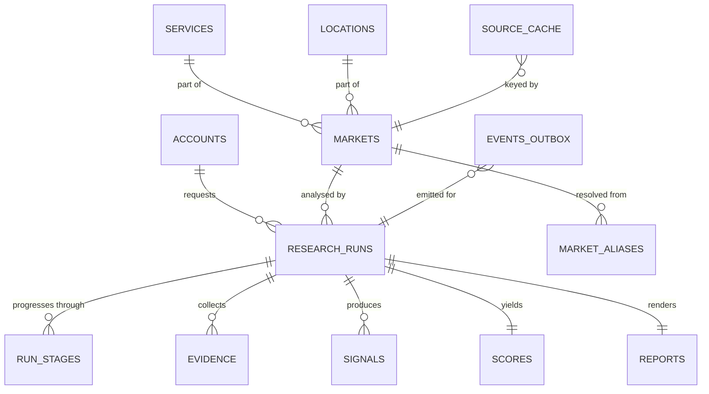

# 02 — Data Model

**Status:** APPROVED — 2026-08-27
**Last updated:** 2026-08-27
**Prerequisite reading:** `00-overview.md`, `01-architecture.md`, `07-data-sources.md`
**Implements:** ADR-0002 (Supabase Postgres), ADR-0005 (7-day freshness)

This document specifies the database. It is the contract the migrations
implement. Migration files never introduce a table or column that is not
described here.

---

## 1. Principles

1. **The market is the spine.** Every run, evidence row, signal and report hangs
   off one canonical `market` (`00-overview.md` §2).
2. **Evidence is immutable and attributed.** Rows are written once, never
   updated. Every row records which vendor produced it and when.
3. **Scoring reads evidence; it never collects.** Re-tuning weights is a
   re-score over stored evidence, not a re-run.
4. **Aggregates are permanent; identity is transient.** Required by Google Maps
   Platform terms (`07-data-sources.md` §5.1). Enforced in the schema by
   `expires_at`, not by convention.
5. **Postgres is also the queue.** Runs are claimed with
   `SELECT … FOR UPDATE SKIP LOCKED`. No external broker.
6. **JSONB for vendor payloads, columns for anything queried.** Vendor response
   shapes change; our query surface should not.

---

## 2. Entity overview



---

## 3. Tables

### 3.1 `accounts`

Application-level profile. Authentication itself lives in Supabase `auth.users`
(ADR-0002); this table holds only what the product needs.

| Column | Type | Notes |
|---|---|---|
| `id` | `uuid` PK | Same value as `auth.users.id` |
| `email` | `citext` NOT NULL | Denormalised for display and support |
| `display_name` | `text` | |
| `access_tier` | `access_tier` NOT NULL DEFAULT `'early_access'` | Enum; billing is out of MVP scope |
| `run_quota_month` | `int` NOT NULL DEFAULT 50 | Simple abuse ceiling, not a billing plan |
| `created_at` | `timestamptz` NOT NULL DEFAULT `now()` | |

### 3.2 `services`

The canonical service taxonomy. Seeded, curated, small.

| Column | Type | Notes |
|---|---|---|
| `id` | `bigint` PK | |
| `slug` | `text` UNIQUE NOT NULL | `plumbing`, `emergency-plumbing` |
| `display_name` | `text` NOT NULL | "Plumbing" |
| `parent_id` | `bigint` FK → `services.id` NULL | Sub-services point at their parent |
| `keyword_seeds` | `jsonb` NOT NULL | Templates the demand collector expands |
| `anzsic_code` | `text` NULL | Bridges to ABS data (`07` §5.3) |
| `is_active` | `boolean` NOT NULL DEFAULT true | |

### 3.3 `locations`

| Column | Type | Notes |
|---|---|---|
| `id` | `bigint` PK | |
| `slug` | `text` UNIQUE NOT NULL | `au-qld-brisbane` |
| `country_code` | `char(2)` NOT NULL | ISO 3166-1 alpha-2 |
| `admin1` | `text` NULL | State/territory — `QLD` |
| `locality` | `text` NULL | `Brisbane` |
| `granularity` | `location_granularity` NOT NULL | `country` / `admin1` / `city` / `suburb` |
| `display_name` | `text` NOT NULL | "Brisbane, QLD" |
| `population` | `int` NULL | Denominator for per-capita density (`07` §5.3) |
| `vendor_geo_ids` | `jsonb` NOT NULL DEFAULT `'{}'` | Per-vendor location codes, e.g. Google Ads criterion ID |

`vendor_geo_ids` keeps vendor-specific identifiers out of collector code and in
data, so adding a vendor does not mean a schema change.

### 3.4 `markets`

| Column | Type | Notes |
|---|---|---|
| `id` | `uuid` PK | |
| `service_id` | `bigint` FK NOT NULL | |
| `location_id` | `bigint` FK NOT NULL | |
| `market_key` | `text` UNIQUE NOT NULL | `plumbing@au-qld-brisbane` — generated |
| `created_at` | `timestamptz` NOT NULL DEFAULT `now()` | |

`UNIQUE (service_id, location_id)`. `market_key` is a generated column used for
logs, cache keys and URLs.

### 3.5 `market_aliases`

What makes ADR-0005's freshness window actually hit. Raw user input is recorded
against the market it resolved to, so resolution improves over time and is
auditable.

| Column | Type | Notes |
|---|---|---|
| `id` | `bigint` PK | |
| `raw_input` | `text` NOT NULL | Normalised: lowercased, punctuation stripped, whitespace collapsed |
| `market_id` | `uuid` FK NOT NULL | |
| `resolution_method` | `resolution_method` NOT NULL | `exact` / `alias` / `fuzzy` / `manual` |
| `confidence` | `numeric(4,3)` NOT NULL | |
| `first_seen_at` / `last_seen_at` | `timestamptz` NOT NULL | |
| `hit_count` | `int` NOT NULL DEFAULT 1 | |

`UNIQUE (raw_input)`.

⚠️ Resolution below a configured confidence threshold must **not** silently pick
a market. The API returns the candidates and asks the user to choose
(`05-api-contract.md` §5.2). A wrong silent match produces a confident report
about the wrong market — the worst failure this product can have.

### 3.6 `research_runs`

| Column | Type | Notes |
|---|---|---|
| `id` | `uuid` PK | |
| `market_id` | `uuid` FK NOT NULL | |
| `requested_by` | `uuid` FK → `accounts.id` NULL | NULL for system/scheduled runs |
| `status` | `run_status` NOT NULL DEFAULT `'queued'` | See §4 |
| `current_stage` | `run_stage` NULL | |
| `trigger` | `run_trigger` NOT NULL | `user` / `forced_refresh` / `scheduled` / `system` |
| `requested_at` | `timestamptz` NOT NULL DEFAULT `now()` | |
| `started_at` / `completed_at` | `timestamptz` NULL | |
| `claimed_at` | `timestamptz` NULL | Set when a worker claims it |
| `claimed_by` | `text` NULL | Worker instance id, for stuck-run recovery |
| `attempt` | `int` NOT NULL DEFAULT 0 | |
| `budget_cents` | `int` NOT NULL | Per-run ceiling (`07` §8) |
| `spend_cents` | `int` NOT NULL DEFAULT 0 | Running total |
| `error_code` / `error_detail` | `text` NULL | |

**Indexes**

- `(status, requested_at)` — the queue claim path.
- `(market_id, completed_at DESC) WHERE status IN ('complete','partial')` — the
  freshness lookup. This index *is* ADR-0005; without it the cache check is a
  sequential scan.

**Claim query**

```sql
UPDATE research_runs SET status='collecting', claimed_at=now(), claimed_by=$1,
       started_at=COALESCE(started_at, now()), attempt=attempt+1
WHERE id = (
  SELECT id FROM research_runs
  WHERE status='queued'
  ORDER BY requested_at
  FOR UPDATE SKIP LOCKED
  LIMIT 1
) RETURNING *;
```

**Stuck-run recovery:** a run in a non-terminal state whose `claimed_at` is
older than a configured lease is returned to `queued` by a reaper. Without this,
one worker crash strands a run forever.

### 3.7 `run_stages`

One row per stage attempt. This is what the app's progress timeline renders.

| Column | Type | Notes |
|---|---|---|
| `id` | `bigint` PK | |
| `run_id` | `uuid` FK NOT NULL | |
| `stage` | `run_stage` NOT NULL | |
| `status` | `stage_status` NOT NULL | `pending`/`running`/`ok`/`failed`/`skipped` |
| `attempt` | `int` NOT NULL DEFAULT 1 | |
| `started_at` / `finished_at` | `timestamptz` NULL | |
| `error_code` / `error_detail` | `text` NULL | |

`UNIQUE (run_id, stage, attempt)`.

### 3.8 `evidence`

The asset. Append-only.

| Column | Type | Notes |
|---|---|---|
| `id` | `uuid` PK | |
| `run_id` | `uuid` FK NOT NULL | |
| `market_id` | `uuid` FK NOT NULL | Denormalised so re-scoring can read across runs |
| `signal` | `signal_key` NOT NULL | Which of the six this supports |
| `collector` | `text` NOT NULL | Module name |
| `vendor` | `text` NOT NULL | `dataforseo`, `abs`, `tavily`, `fixture` |
| `endpoint` | `text` NOT NULL | Vendor endpoint |
| `status` | `evidence_status` NOT NULL | `ok` / `absent` / `error` |
| `payload` | `jsonb` NOT NULL | Normalised extract — **not** the raw HTTP body |
| `source_url` | `text` NULL | Required for web-research evidence (`07` §6.2) |
| `fetched_at` | `timestamptz` NOT NULL DEFAULT `now()` | |
| `expires_at` | `timestamptz` NULL | NULL = permanent. Non-NULL = purge (§6) |
| `cost_cents` | `numeric(8,4)` NOT NULL DEFAULT 0 | |
| `request_hash` | `text` NOT NULL | Ties the row to its `source_cache` entry |

**`status='absent'` is the mechanism for fail-soft** (`01-architecture.md` §5). A
collector that fails writes an `absent` row with the reason. Scoring sees an
explicit absence rather than missing data, and the report can state which
signals were unavailable — required by `00-overview.md` §7.

**Indexes:** `(run_id, signal)`; `(market_id, signal, fetched_at DESC)`;
`(expires_at) WHERE expires_at IS NOT NULL`.

### 3.9 `signals`

| Column | Type | Notes |
|---|---|---|
| `run_id` | `uuid` FK NOT NULL | |
| `signal` | `signal_key` NOT NULL | |
| `score` | `numeric(5,2)` NULL | 0–100; NULL when not computable |
| `confidence` | `numeric(4,3)` NOT NULL | 0–1 |
| `band` | `signal_band` NULL | `low`/`moderate`/`high`/`growing`/`declining` — the words the UI shows |
| `inputs` | `jsonb` NOT NULL | The values used, for display and audit |
| `method_version` | `text` NOT NULL | Normalisation version |
| `notes` | `text` NULL | e.g. "trend measured at state level" (`07` §7.1) |

PK `(run_id, signal)`.

### 3.10 `scores`

| Column | Type | Notes |
|---|---|---|
| `run_id` | `uuid` PK/FK | |
| `opportunity_score` | `numeric(5,2)` NOT NULL | 0–100 |
| `verdict` | `verdict` NOT NULL | `pursue` / `watch` / `pass` |
| `confidence` | `numeric(4,3)` NOT NULL | |
| `weights_version` | `text` NOT NULL | From `04-signals-and-scoring.md` |
| `computed_at` | `timestamptz` NOT NULL DEFAULT `now()` | |

One row per run. Re-scoring an existing run writes a new row only if
`weights_version` changes — otherwise it is an update, because the inputs are
identical by construction.

### 3.11 `reports`

| Column | Type | Notes |
|---|---|---|
| `run_id` | `uuid` PK/FK | |
| `payload` | `jsonb` NOT NULL | The structured report the app renders |
| `generator` | `report_generator` NOT NULL | `llm` / `template` |
| `provider` / `model` | `text` NULL | NULL when `generator='template'` |
| `prompt_version` | `text` NULL | |
| `generated_at` | `timestamptz` NOT NULL DEFAULT `now()` | |

`generator='template'` is a first-class value, not an error state — it is both
the schema-violation fallback and the no-LLM path used before a provider is
wired up (ADR-0004).

### 3.12 `source_cache`

Vendor-response cache, separate from evidence because it is keyed by *request*,
not by run.

| Column | Type | Notes |
|---|---|---|
| `request_hash` | `text` PK | Hash of vendor + endpoint + canonical params |
| `vendor` / `endpoint` | `text` NOT NULL | |
| `market_id` | `uuid` FK NULL | For targeted invalidation |
| `payload` | `jsonb` NOT NULL | |
| `fetched_at` | `timestamptz` NOT NULL | |
| `expires_at` | `timestamptz` NOT NULL | **Per-source TTL**, not the global window |

Two distinct freshness concepts, and conflating them would be a bug:

- **Run-level freshness (7 days, ADR-0005)** — should we return an existing
  report instead of running again?
- **Source-level TTL** — within a run that *is* executing, may this particular
  vendor call be served from cache? Business listings tolerate weeks; ad
  activity does not.

### 3.13 `events_outbox`

The seam that keeps n8n optional (ADR-0006). Events are written in the same
transaction as the state change and delivered by a separate poller, so a
delivery failure can never fail a run.

| Column | Type | Notes |
|---|---|---|
| `id` | `bigint` PK | |
| `event_type` | `text` NOT NULL | `run.completed`, `run.failed`, `lead.created` |
| `payload` | `jsonb` NOT NULL | |
| `created_at` | `timestamptz` NOT NULL DEFAULT `now()` | |
| `delivered_at` | `timestamptz` NULL | |
| `attempts` | `int` NOT NULL DEFAULT 0 | |
| `last_error` | `text` NULL | |

With no webhook URLs configured, rows accumulate and are pruned. Nothing breaks.

---

## 4. Enumerated types

| Type | Values |
|---|---|
| `run_status` | `queued`, `collecting`, `scoring`, `analyzing`, `complete`, `partial`, `failed`, `cancelled` |
| `run_stage` | `resolve`, `collect_demand`, `collect_competition`, `collect_advertising`, `collect_density`, `collect_value`, `collect_trends`, `score`, `analyze`, `finalize` |
| `stage_status` | `pending`, `running`, `ok`, `failed`, `skipped` |
| `signal_key` | `demand`, `competition`, `advertising`, `density`, `customer_value`, `trends` |
| `signal_band` | `low`, `moderate`, `high`, `growing`, `declining`, `unknown` |
| `verdict` | `pursue`, `watch`, `pass` |
| `evidence_status` | `ok`, `absent`, `error` |
| `report_generator` | `llm`, `template` |
| `run_trigger` | `user`, `forced_refresh`, `scheduled`, `system` |
| `resolution_method` | `exact`, `alias`, `fuzzy`, `manual` |
| `location_granularity` | `country`, `admin1`, `city`, `suburb` |
| `access_tier` | `early_access`, `internal`, `disabled` |

`signal_key` mirrors the six signals fixed in `00-overview.md` §4. Adding a
value is an architectural change.

---

## 5. State machine

```
queued ──▶ collecting ──▶ scoring ──▶ analyzing ──▶ complete
   │            │             │            │
   │            └─────────────┴────────────┴──▶ partial   (scored, gaps declared)
   │
   └──▶ cancelled                            └──▶ failed  (insufficient evidence)
```

- `partial` is a **success** state: a score was produced with declared gaps. The
  app shows the report with reduced confidence and names the missing signals.
- `failed` means too little evidence to score honestly. No score is invented —
  `00-overview.md` §5, explicit non-goal.
- Transitions are written with the outbox event in the same transaction.

---

## 6. Retention and the TTL purge

| Data | Retention | Why |
|---|---|---|
| Aggregate evidence (counts, distributions, percentiles) | Permanent | Our derived analysis |
| Per-business identity (name, address, coordinates, review text) | **30 days**, then purged | Google Maps Platform terms (`07` §5.1) |
| `place_id` values | Permanent | Explicitly permitted |
| `source_cache` rows | Per-source TTL | Cost control |
| Signals, scores, reports | Permanent | The product |
| `events_outbox` delivered rows | 30 days | Housekeeping |

The purge is a scheduled job **inside the engine**, not n8n (ADR-0006), running
`DELETE FROM evidence WHERE expires_at < now()`. It must be covered by a test
that fails if a purge would orphan a report's aggregates — the score must never
depend on a row the terms require us to delete.

---

## 7. Migrations

- Plain numbered SQL files, forward-only: `db/migrations/0001_initial.sql`.
- No ORM-generated migrations. The schema is specified here and written by hand;
  an AI assistant editing SQL against this document is easier to review than a
  generated diff.
- Every migration is idempotent-safe to re-run in development.
- Enum values are added, never removed or reordered.

---

## 8. Row-level security

Deferred to `09-security-privacy.md`, but the shape is fixed now: the engine
connects as a service role and enforces ownership in application code, because
the worker legitimately operates across all accounts. Supabase RLS is a second
layer for any direct client access, which the MVP does not use.

---

## 9. Open questions

1. **Large raw payloads.** `evidence.payload` holds a normalised extract, not
   raw bodies. If raw responses must be retained for debugging, they belong in
   object storage keyed by `request_hash` — not in an 8 GB Postgres allowance
   (ADR-0002). Decide before the first real collector.
2. **`locations.population` source.** ABS for Australia; unresolved elsewhere.
   Affects whether per-capita density is available outside AU.
3. **Re-scoring history.** Should a re-score with new weights create a new run
   or a new `scores` row? Current spec says a new row keyed by
   `weights_version`; confirm when `04-signals-and-scoring.md` is written.
